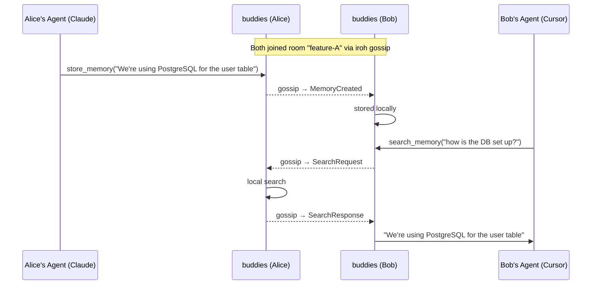
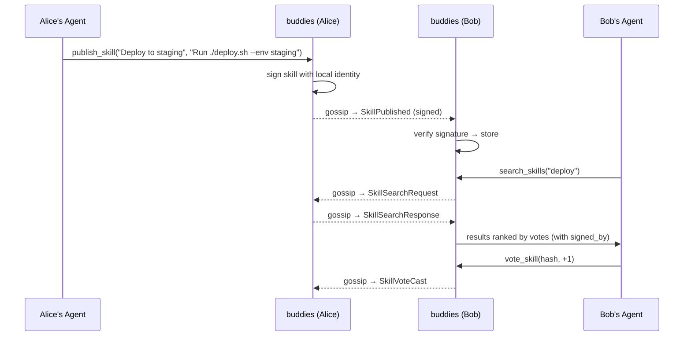
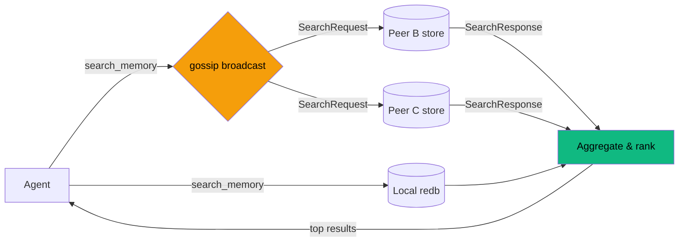
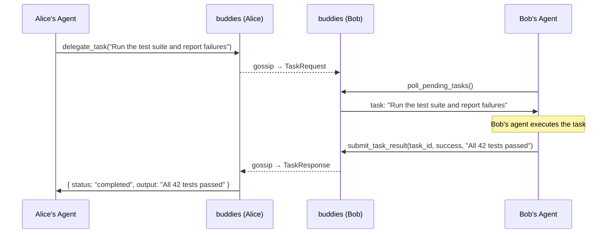
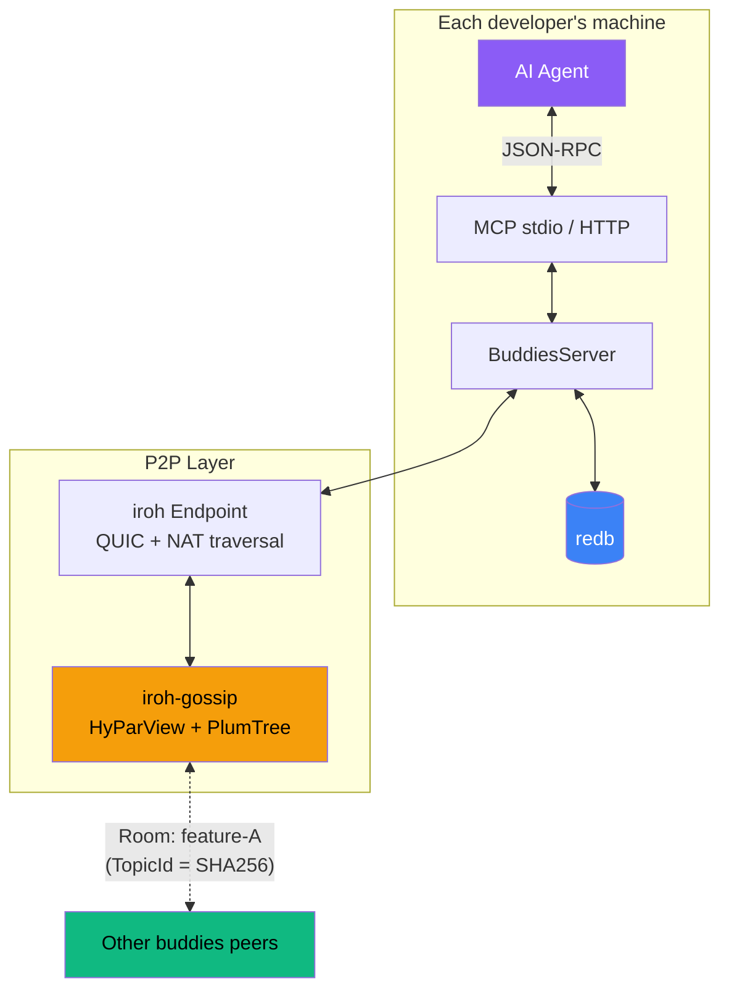

# buddies

**P2P communication layer for AI agents — let your team's agents talk to each other, share knowledge, delegate tasks, and stay in sync over encrypted gossip.**

buddies is an MCP server that gives AI agents a direct communication channel across team members in real-time — no central server, no cloud, just direct P2P connections powered by [Iroh](https://iroh.computer).

Your backend team is building Feature A. Your frontend team is on Feature B. Each developer's agent joins a **room**, and suddenly every agent knows what the others are doing. Decisions don't get lost. Context doesn't get repeated. Agents search each other's knowledge like it's their own.

## How it works



Each buddies instance runs locally alongside your agent. Memories are stored on disk and shared over encrypted QUIC connections. When an agent searches, it queries both its local store and every peer in the room — results come back in seconds.

## Quick start
```bash
# One-line install + configure
curl -sSf https://raw.githubusercontent.com/iltumio/buddies/main/install.sh | bash

# Or clone and use the installer
git clone https://github.com/iltumio/buddies
cd buddies
./install.sh --all  # Claude Code + OpenCode + OpenClaw
```

The installer builds from source, detects your signing identity, and configures Claude Code, OpenCode, and/or OpenClaw automatically. Run `./install.sh --help` for options.

Manual setup:

```bash
cargo install --path .

# Alice opens a room
BUDDIES_USER=alice buddies
# Agent calls: join_room({ "room": "feature-a" })
# → returns a ticket

# Bob joins with Alice's ticket
BUDDIES_USER=bob buddies
# Agent calls: join_room({ "room": "feature-a", "ticket": "<ticket>" })
# → connected

# Or run as a standalone HTTP server
BUDDIES_TRANSPORT=http BUDDIES_USER=alice buddies
# → buddies MCP server listening on http://127.0.0.1:8080/mcp
```

Add to your MCP client config:

**Claude Desktop / Claude Code:**

```json
{
  "mcpServers": {
    "buddies": {
      "command": "buddies",
      "env": {
        "BUDDIES_USER": "your-name"
      }
    }
  }
}
```

**OpenCode** (stdio — spawned by opencode):

```json
{
  "mcp": {
    "buddies": {
      "type": "local",
      "command": ["buddies"],
      "environment": {
        "BUDDIES_USER": "your-name"
      }
    }
  }
}
```

**OpenCode** (remote — connect to running buddies instance):

```json
{
  "mcp": {
    "buddies": {
      "type": "remote",
      "url": "http://localhost:8080/mcp"
    }
  }
}
```

**OpenClaw** (in your workspace config or via `openclaw onboard`):

```json
{
  "mcpServers": {
    "buddies": {
      "command": "buddies",
      "args": [],
      "env": {
        "BUDDIES_USER": "your-name",
        "BUDDIES_SIGNER": "git"
      }
    }
  }
}
```

Or just tell OpenClaw in natural language: *"Add buddies as a local MCP stdio server with BUDDIES_USER=your-name"*

## Tools

| Tool | Description |
|------|-------------|
| **join_room** | Join a named room. Returns a ticket for others to connect. |
| **leave_room** | Leave a room. |
| **store_memory** | Save a memory and broadcast it to every peer in the room. |
| **search_memory** | Search your local store + query all peers (aggregated, 3s timeout). |
| **list_memories** | List local memories with optional filters. |
| **notify_peers** | Broadcast a status update ("I just finished the auth module"). |
| **get_room_status** | See who's in the room and what they're working on. |
| **list_rooms** | List all rooms you've joined. |
| **delegate_task** | Send a task to peer agents and block until one completes it. |
| **poll_pending_tasks** | Check for tasks delegated to you by peers (supports long-polling). |
| **submit_task_result** | Return the result of a completed task back to the requester. |
| **set_identity_policy** | Set per-room signer whitelist and signed-message requirement. |
| **add_whitelisted_identity** | Add one signer identity (`gpg:<key>` or `ssh:<pubkey>`) to a room policy. |
| **get_identity_policy** | Read current room identity policy and local signer identity. |
| **publish_skill** | Publish a digitally signed, content-addressable skill and broadcast to all peers. |
| **search_skills** | Search skills locally + across all peers, ranked by votes. |
| **vote_skill** | Upvote (+1) or downvote (-1) a skill. Votes propagate to all peers. |
| **get_skill** | Retrieve a specific skill by its content hash. |

## Memory types

When storing a memory, tag it with a kind:

- **decision** — "We decided to use JWT for auth"
- **implementation** — "Auth middleware lives in `src/middleware/auth.rs`"
- **context** — "The API contract requires a `user_id` field in all responses"
- **skill** — "Run `cargo test -- --nocapture` to see test output"
- **status** — "Auth module is 80% done, blocked on the DB migration"

## Skill sharing

Skills are reusable, content-addressable knowledge entries that agents can publish, discover, and vote on across the P2P network. Unlike memories (which capture what happened), skills capture how to do things — commands, procedures, workflows.

Each skill is identified by a SHA-256 hash of its content (title + body + tags), so identical skills published by different peers are automatically deduplicated. Peers vote on skills to surface the best ones.

### Signed skills

Skills are **digitally signed** using your configured identity (GPG or SSH). The signature is embedded directly in the skill entry and persists in storage, so any peer can verify the author’s identity at any time — not just at the moment of receipt.

- When you publish a skill, buddies signs it with your local signer
- When a peer receives a skill, the embedded signature is verified before storing
- Skills with invalid signatures are rejected
- The `signed_by` field (e.g. `gpg:ABC123` or `ssh:ssh-ed25519 ...`) is returned in search results and skill lookups

This is separate from the transport-level P2P message signatures — skill signatures prove *who authored the content*, while message signatures prove *who sent the gossip message*.



Skills support versioning via `parent_hash` — publish an updated skill referencing the previous version's hash to create a revision chain.

## The search flow

No data is replicated unless explicitly stored. Peers only share what matches your query.



## Task delegation

Agents can delegate work to each other across the P2P network. Alice's agent can ask Bob's agent to run tests, check a file, or do anything — and get the result back as if it happened locally.



The delegator's `delegate_task` call **blocks** until a result comes back (or the timeout expires), so from the agent's perspective it feels like a local tool call. On the other side, the receiving agent uses `poll_pending_tasks` (with long-polling support) to pick up work, does whatever it needs to do, and calls `submit_task_result` to send the answer back.

## Configuration

| Environment variable | Default | Description |
|---------------------|---------|-------------|
| `BUDDIES_USER` | OS username | Your display name in rooms |
| `BUDDIES_AGENT` | `unknown-agent` | Which agent you're using |
| `BUDDIES_DATA_DIR` | `~/.local/share/buddies` | Where local memories are stored |
| `RUST_LOG` | `warn` | Log level (logs go to stderr, never pollutes MCP stdio) |
| `BUDDIES_TRANSPORT` | `stdio` | Transport mode: `stdio` (default, for MCP clients that spawn the process) or `http` (standalone HTTP server) |
| `BUDDIES_PORT` | `8080` | HTTP listen port (only used when `BUDDIES_TRANSPORT=http`) |
| `BUDDIES_HOST` | `127.0.0.1` | HTTP bind address (only used when `BUDDIES_TRANSPORT=http`) |
| `BUDDIES_SIGNER` | `git` | Signing identity source: `git`, `none`, `gpg`, `ssh`, `generated` |
| `BUDDIES_GPG_KEY_ID` | unset | GPG key ID when `BUDDIES_SIGNER=gpg` (or use `BUDDIES_SIGNING_KEY`) |
| `BUDDIES_SSH_PRIVATE_KEY` | unset | SSH private key path when `BUDDIES_SIGNER=ssh` |
| `BUDDIES_SSH_PUBLIC_KEY` | inferred | SSH public key value or path when `BUDDIES_SIGNER=ssh` |
| `BUDDIES_SIGNING_KEY` | unset | Generic fallback for `BUDDIES_GPG_KEY_ID` or `BUDDIES_SSH_PRIVATE_KEY` |

### Startup identity options

- Use existing git signing identity (default):
  - `BUDDIES_SIGNER=git`
  - Reads `git config user.signingkey` and `git config gpg.format`
- Provide explicit key at startup:
  - GPG: `BUDDIES_SIGNER=gpg BUDDIES_GPG_KEY_ID=<key-id> buddies`
  - SSH: `BUDDIES_SIGNER=ssh BUDDIES_SSH_PRIVATE_KEY=~/.ssh/id_ed25519 buddies`
- Generate identity on first start and reuse it:
  - `BUDDIES_SIGNER=generated buddies`
  - Generates `identity_ed25519` in `BUDDIES_DATA_DIR` and uses it for signing

## Identity trust model

- Outbound gossip messages are signed when a local signer is configured.
- Published skills are signed at the content level (signature embedded in the skill entry).
- Per-room policies can require signed messages and/or enforce whitelisted signer identities.
- Identity label format is:
  - `gpg:<key-id>`
  - `ssh:<public-key>`
- If a room has whitelist entries, messages from non-whitelisted identities are dropped.
- If `require_signed=true`, unsigned messages are dropped.
- Incoming skills with invalid embedded signatures are rejected.

Example policy setup:

```json
{
  "tool": "set_identity_policy",
  "args": {
    "room": "feature-a",
    "identities": [
      "gpg:ABC123DEF456",
      "ssh:ssh-ed25519 AAAAC3Nza... alice@laptop"
    ],
    "require_signed": true
  }
}
```

## Architecture



- **Transport**: MCP over stdio (default) or streamable HTTP — stdio for clients that spawn the process, HTTP for standalone deployment
- **Networking**: [Iroh](https://iroh.computer) — QUIC connections with NAT hole-punching and relay fallback
- **Gossip**: [iroh-gossip](https://github.com/n0-computer/iroh-gossip) — epidemic broadcast trees (HyParView + PlumTree)
- **Storage**: [redb](https://github.com/cberner/redb) — embedded key-value store, single file, zero config
- **Wire format**: [postcard](https://github.com/jamesmunns/postcard) — compact binary serialization for gossip messages

Rooms map to gossip topics via deterministic SHA-256 hashing. Same room name = same topic = same swarm. Peers discover each other through Iroh's relay infrastructure and direct QUIC hole-punching.

## Building from source

```bash
git clone https://github.com/iltumio/buddies
cd buddies
cargo build --release
```

Requires Rust 2024 edition (1.85+).

## License

AGPL-3.0 — see [LICENSE](LICENSE)
