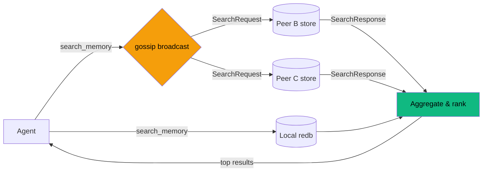
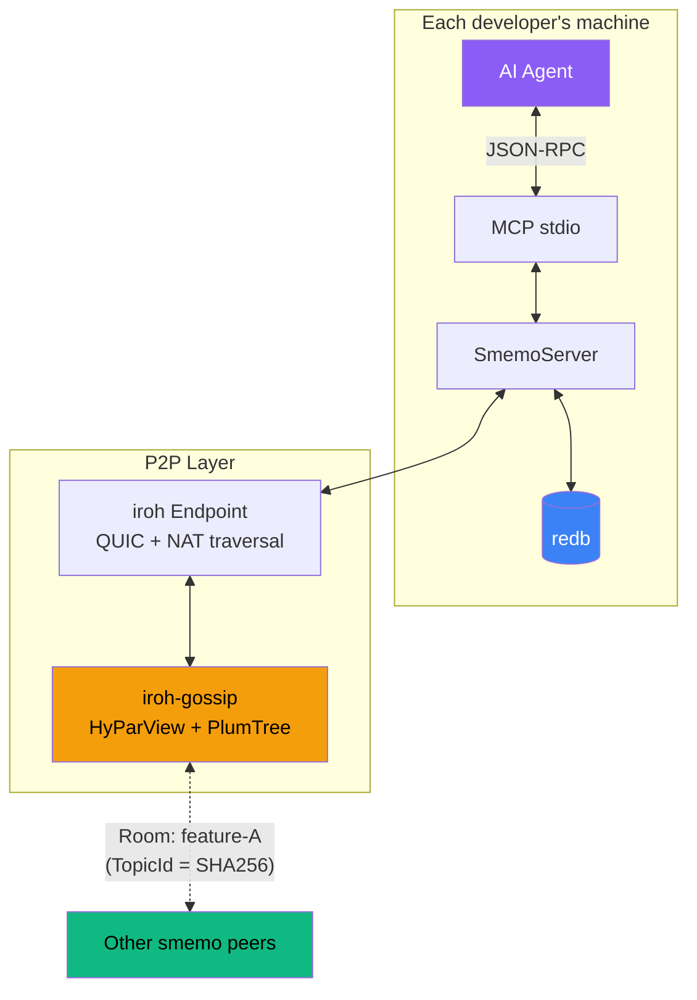

# smemo

**P2P shared memory for AI agents — let your team's agents search each other's knowledge, delegate tasks, and stay in sync over encrypted gossip.**

smemo is an MCP server that lets AI agents share memories, decisions, and context across team members in real-time — no central server, no cloud, just direct P2P connections powered by [Iroh](https://iroh.computer).

Your backend team is building Feature A. Your frontend team is on Feature B. Each developer's agent joins a **room**, and suddenly every agent knows what the others are doing. Decisions don't get lost. Context doesn't get repeated. Agents search each other's knowledge like it's their own.

## How it works


Each smemo instance runs locally alongside your agent. Memories are stored on disk and shared over encrypted QUIC connections. When an agent searches, it queries both its local store and every peer in the room — results come back in seconds.

## Quick start

```bash
cargo install --path .

# Alice opens a room
SMEMO_USER=alice smemo
# Agent calls: join_room({ "room": "feature-a" })
# → returns a ticket

# Bob joins with Alice's ticket
SMEMO_USER=bob smemo
# Agent calls: join_room({ "room": "feature-a", "ticket": "<ticket>" })
# → connected
```

Add to your MCP client config (e.g. Claude Desktop):

```json
{
  "mcpServers": {
    "smemo": {
      "command": "smemo",
      "env": {
        "SMEMO_USER": "your-name"
      }
    }
  }
}
```

## Tools

| Tool | Description |
|------|-------------|
| **join_room** | Join a named room. Returns a ticket for others to connect. |
| **leave_room** | Leave a room. |
| **store_memory** | Save a memory and broadcast it to every peer in the room. |
| **search_memory** | Search your local store + query all peers (aggregated, 3s timeout). |
| **list_memories** | List local memories with optional filters. |
| **notify_peers** | Broadcast a status update ("I just finished the auth module"). |
| **get_room_status** | See who's in the room and what they're working on. |
| **list_rooms** | List all rooms you've joined. |
| **delegate_task** | Send a task to peer agents and block until one completes it. |
| **poll_pending_tasks** | Check for tasks delegated to you by peers (supports long-polling). |
| **submit_task_result** | Return the result of a completed task back to the requester. |

## Memory types

When storing a memory, tag it with a kind:

- **decision** — "We decided to use JWT for auth"
- **implementation** — "Auth middleware lives in `src/middleware/auth.rs`"
- **context** — "The API contract requires a `user_id` field in all responses"
- **skill** — "Run `cargo test -- --nocapture` to see test output"
- **status** — "Auth module is 80% done, blocked on the DB migration"

## The search flow

No data is replicated unless explicitly stored. Peers only share what matches your query.



## Task delegation

Agents can delegate work to each other across the P2P network. Alice's agent can ask Bob's agent to run tests, check a file, or do anything — and get the result back as if it happened locally.


The delegator's `delegate_task` call **blocks** until a result comes back (or the timeout expires), so from the agent's perspective it feels like a local tool call. On the other side, the receiving agent uses `poll_pending_tasks` (with long-polling support) to pick up work, does whatever it needs to do, and calls `submit_task_result` to send the answer back.

## Configuration

| Environment variable | Default | Description |
|---------------------|---------|-------------|
| `SMEMO_USER` | OS username | Your display name in rooms |
| `SMEMO_AGENT` | `unknown-agent` | Which agent you're using |
| `SMEMO_DATA_DIR` | `~/.local/share/smemo` | Where local memories are stored |
| `RUST_LOG` | `warn` | Log level (logs go to stderr, never pollutes MCP stdio) |

## Architecture



- **Transport**: MCP over stdio (works with any MCP client)
- **Networking**: [Iroh](https://iroh.computer) — QUIC connections with NAT hole-punching and relay fallback
- **Gossip**: [iroh-gossip](https://github.com/n0-computer/iroh-gossip) — epidemic broadcast trees (HyParView + PlumTree)
- **Storage**: [redb](https://github.com/cberner/redb) — embedded key-value store, single file, zero config
- **Wire format**: [postcard](https://github.com/jamesmunns/postcard) — compact binary serialization for gossip messages

Rooms map to gossip topics via deterministic SHA-256 hashing. Same room name = same topic = same swarm. Peers discover each other through Iroh's relay infrastructure and direct QUIC hole-punching.

## Building from source

```bash
git clone https://github.com/iltumio/smemo
cd smemo
cargo build --release
```

Requires Rust 2024 edition (1.85+).

## License

AGPL-3.0 — see [LICENSE](LICENSE)
